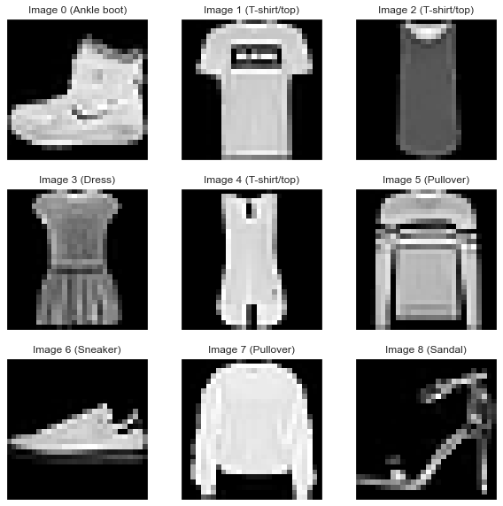
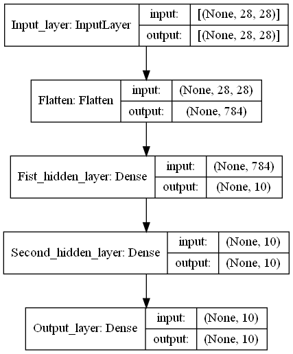
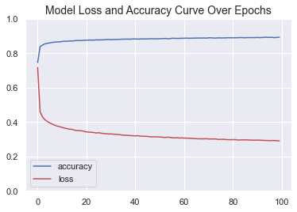
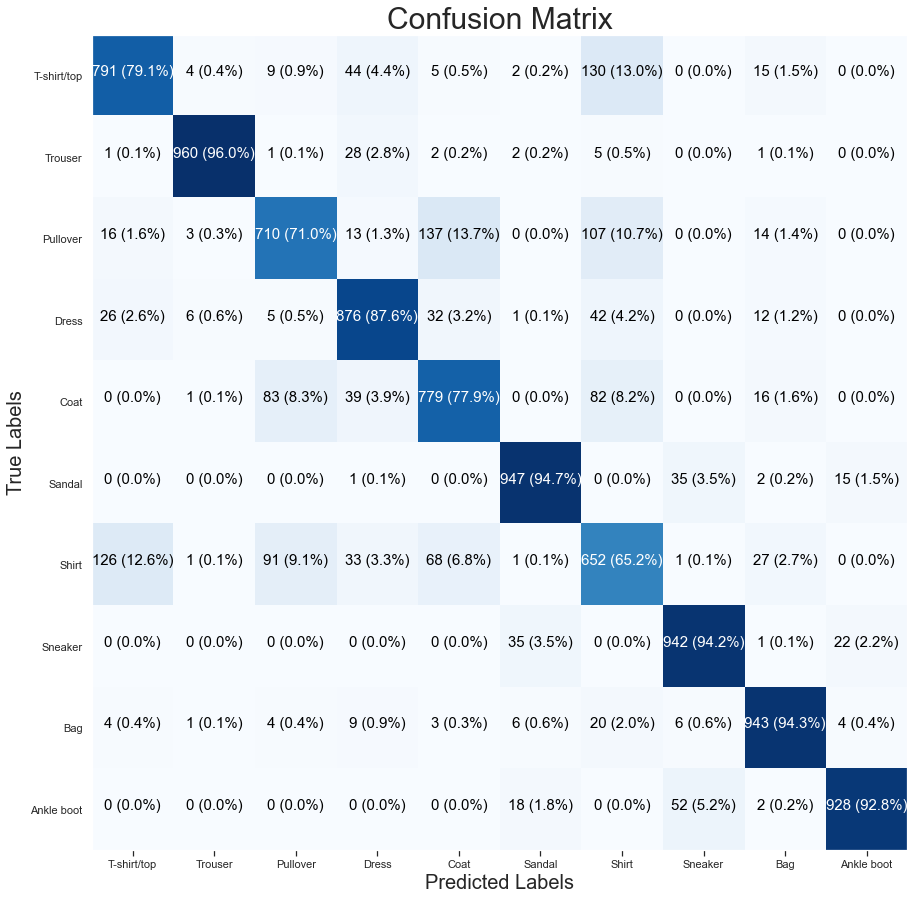

# Fashion MNIST Multi-class Classification Using TensorFlow

Data exploration and multi-class classification of the [fashion MNIST dataset](https://github.com/zalandoresearch/fashion-mnist) with 89% accuracy using TensorFlow.


## Built With

* [Jupyter Notebook](https://jupyter.org/) - An application that allows you to create and share documents that contain live code, equations, visualizations and narrative text.
* [Python](https://www.python.org/) - A programming language that lets you work quickly and integrate systems more effectively.
* [TensorFlow](https://www.tensorflow.org/) - An end-to-end open source machine learning platform.
* [Scikit-Learn](https://scikit-learn.org/stable/index.html) - Simple and efficient tools for predictive data analysis.
* [NumPy](https://numpy.org/) - The fundamental package for scientific computing with Python.
* [Pandas](https://pandas.pydata.org/) - A fast, powerful, flexible and easy to use open source data analysis and manipulation tool.
* [Matplotlib](https://matplotlib.org/) - A comprehensive library for creating static, animated, and interactive visualizations in Python.
* [Seaborn](https://seaborn.pydata.org/) - Seaborn is a Python data visualization library based on matplotlib. It provides a high-level interface for drawing attractive and informative statistical graphics.


## Getting Started 

Make sure you can open Jupyter Notebooks on your plataform and that you have all the dependancies cited before on your environment. If not, follow the instalation guides for each plataform.


---------------------------------

> ## The complete classification project code can be seen on the [classification](./classification.ipynb) file.

------------------------------------

## The Data

The Dataset is divided in 60000 training example and 10000 test example. Each example consists of a 28x28 greyscale image, associated with a label from 10 classes. 

Each training and test example is assigned to one of the following labels:

| Label | Description |
|-------|-------------|
| 0     | T-shirt/top |
| 1     | Trouser     |
| 2     | Pullover    |
| 3     | Dress       |
| 4     | Coat        |
| 5     | Sandal      |
| 6     | Shirt       |
| 7     | Sneaker     |
| 8     | Bag         |
| 9     | Ankle boot  |


The First 9 images of the dataset look like:




## The Model

The supervised neural network model consists of a flattening layer to transform the 28 by 28 image input into a one dimentional array of 784 entries. Then the model has 2 hidden layers with 10 neurons each all with a ReLU activation function. The output layer of the model has 10 neurons for each class and its values are calculated with a softmax function.

The model is compiled using the Adam optimizer with a 0.001 learning rate and its loss function is calculated using cross-entropy.




## Training Results




## Test Results




As we can see on the confusion matrix, the model performs well on the test data having its worse performance on distiguishing between the ```T-shit/top``` and ```Shirt``` classes. This is understandable given the similarities between both classes, changes to the model or a better set of training data could lead to better results.